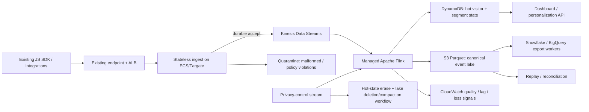

# Engineer 004 — Real-Time Analytics Pipeline

**Brief version:** 2026-07  
**Source commit:** `4b719e4501c8ff98fd3e641c46d3bffe34b9aaa5`  
**Fixture SHA-256 [Observed]:** `1aeb24b415009e89fcf8acb5a178410faf216dc17b16920d9849ecc8bbb24235`  
**Checkable source [Observed]:** `https://github.com/ericosiu/beat-claude/blob/4b719e4501c8ff98fd3e641c46d3bffe34b9aaa5/challenges/engineer-004/fixtures/event_sample.jsonl`

## Written answer

### Decision

Preserve the existing SDK endpoint and replace the backend in phases. MVP: **ALB → stateless ECS/Fargate ingest → Kinesis Data Streams → Managed Apache Flink → DynamoDB hot state + S3/Parquet historical lake**, plus a thin dashboard API and warehouse-export workers.

I would not promise literal “zero loss.” The contract is **no acknowledged event is lost by design**: acknowledge only after durable Kinesis acceptance; retry partial `PutRecords` failures; quarantine poison records; make consumers idempotent. If durable acceptance is unconfirmed, fail closed.

### Sizing and operating envelope

- **[Observed]** Brief: `50M events/day`, `<5 s` visibility, `10x` spikes, `500+` tenants, `$50K/month` infrastructure ceiling, `2` senior engineers, `3-month` MVP.
- **[Estimated]** `50,000,000 / 86,400 ≈ 579 events/s`; `10x ≈ 5,787 events/s`. **[Assumed]** `1 KiB/event` gives `1,536 GB/30d` before compression.
- **[Assumed target]** p95 freshness budget: durable ingest `≤0.5 s`, stream transform `≤2.0 s`, hot-store write/query `≤1.0 s`, leaving `≥1.5 s` margin. These are SLO targets, not measured performance.

**[Benchmarked] Cost falsification, us-east-1, checked 2026-09-29.** `cost_model.py` uses current AWS-published rates for Kinesis On-Demand Standard (`$0.08/GB` ingest, `$0.04/GB` retrieval, `$0.04/stream-hour`), Managed Flink (`$0.11/KPU-hour` plus one orchestration KPU and `$0.10/GB-month` running state), Fargate Linux/x86 (`$0.000011244/vCPU-s`, `$0.000001235/GB-s`) and DynamoDB Standard on-demand (`$0.625/M` 1-KB writes, `$0.125/M` strongly-consistent 1-KB reads). Sources: `https://aws.amazon.com/kinesis/data-streams/pricing/`, `https://docs.aws.amazon.com/managed-flink/latest/java/how-pricing.html`, `https://aws.amazon.com/fargate/pricing/`, `https://aws.amazon.com/dynamodb/pricing/`.

**[Assumed workload model]** 8 Flink KPUs; 8 Fargate ingest tasks normally and 32 for 10% of time; one 1-KB DynamoDB hot-state write/event, 300M hot reads/month, 500 GB hot state; 2.25 TB steady S3 storage; plus a deliberately large **[Assumed] `$15K/month` reserve** for ALB/NAT/CloudWatch/S3 requests, export/egress, replay and model error. The script estimates **[Estimated] `$2.49K/month` modeled subtotal and `$17.49K/month` conservative envelope**, leaving **[Estimated] `$32.51K`** under the stated ceiling. At **[Assumed] 3 hot-state writes/event** the envelope is **[Estimated] `$19.36K/month`**. Under these assumptions the budget does not falsify the design. Cross-cloud export and real payload/query distributions remain the largest unknowns and must be measured before commitment.

Why this stack: Kinesis avoids Kafka operations; Flink earns its complexity through keyed identity/segment state and event-time semantics; DynamoDB holds derived hot state only; S3 is replay/audit/export. Lambda-only becomes awkward for stateful windows; PostgreSQL/OpenSearch may serve query slices, not durability.

### Scope and trade-offs

**[Observed]** The MVP is `3 months` with `2` senior engineers. Checkable source: the pinned Engineer 004 brief at `https://github.com/ericosiu/beat-claude/blob/4b719e4501c8ff98fd3e641c46d3bffe34b9aaa5/challenges/engineer-004/brief.md`. It excludes multi-region active/active, general ad-hoc analytics, customer-configurable retention UI, ML bot classification, and automated warehouse-schema management. The dashboard serves bounded recent-behavior/segment views; deeper analysis uses the lake/warehouse path. This trades query flexibility for delivery speed, replayability and operability.

With more time/budget I would add disaster-recovery drills, automated Iceberg delete/compaction verification, richer warehouse contracts, and traffic-driven partition/autoscaling tuning—only after real workload distributions exist.

### Event contract, identity and tenant isolation

Canonical envelope: `tenant_id`, `event_id`, `anonymous_id`, optional `user_id`, canonical `type`, client `event_ts`, server `received_at`, schema version, sanitized properties, ingest metadata. `tenant_id` is mandatory before shared processing; Kinesis keys use `tenant_id + hash(subject)` to preserve subject order without making a large tenant one hot shard. Hot-state keys are tenant-scoped, and authorization derives tenant from server credentials, never payload alone.

For `identify`, Flink records `(tenant_id, anonymous_id) → user_id`; raw events remain immutable except privacy deletion/compaction. Prior anonymous events resolve through the mapping rather than destructive history rewrites.

### Fixture: anomaly-by-anomaly behavior

`./analyze_fixture.py` is the operating artifact used for this read.

| Fixture evidence | Pipeline behavior |
|---|---|
| [Observed] `evt-0002` appears twice | Dedupe on `(tenant_id,event_id)` in keyed state with TTL; emit duplicate-rate telemetry; acknowledge a duplicate safely rather than double-counting. |
| [Observed] `evt-0005` has client time ~47 s after receipt; `evt-0006` is ~65 min ahead; `evt-0016` is ~1 year ahead | Preserve client timestamp for audit, but use server receipt time for ingestion ordering. Bound event-time skew; extreme future timestamps are quarantined or processed on receipt-time semantics so they cannot stall watermarks or poison windows. |
| [Observed] `evt-0009` uses `pageview`, `timestamp`, `page_path`, `ref` | Normalize known legacy aliases; quarantine unknown schema versions with a metric. No SDK break. |
| [Observed] `evt-0011` has no `tenant_id` | Reject/quarantine before shared processing. Never guess a tenant; cross-tenant contamination is a P0 privacy failure. |
| [Observed] `evt-0007` carries email + phone inside custom properties | Detect sensitive keys at ingest; encrypt/restrict or redact by tenant policy; exclude them from general aggregates/logs. |
| [Observed] `evt-0012`–`evt-0015` are a scanner-like burst | Flag suspected automation; do not silently delete. Exclude it from personalization/behavior aggregates by policy while retaining auditability. |
| [Observed] `evt-0017` is `delete_all_data` under GDPR | Route to a high-priority privacy-control path. Delete hot state, identity mapping and subject-linked lake rows/objects; block future exports until deletion completion is verified. |
| [Observed] malformed line corresponding to `evt-0020` | Quarantine/DLQ raw bytes + reason + recoverable tenant context; never crash the partition or stop unrelated customers. |
| [Observed] `evt-0003`, `evt-0008`, `evt-0022` are identify events | Apply tenant-scoped anonymous→known identity mapping with auditable mapping history. |

**[Observed]** I would not trust: `evt-0019.count_today=3` without server recomputation; `evt-0012`–`evt-0015` as genuine demand; or future timestamps in `evt-0006`/`evt-0016` as event-time truth. This tiny synthetic fixture also cannot establish system-wide rates.

### Reliability, overload and failure design

Kinesis is the backpressure boundary; scale on incoming bytes/records, throttling and consumer lag, not CPU alone. Flink checkpoints state and writes idempotently. Sinks carry a processing version so replay cannot silently mix semantics. Schema/policy failures become quarantined records plus tenant-specific quality metrics.

**[Assumed] Rollback gates:** During cutover, rollback if any cross-tenant leak occurs; if accepted-event reconciliation differs by `>0.1%` for `15 min`; if p95 freshness exceeds `4 s` for `5 min`; or if privacy-delete verification misses its contractual SLA. The exact numeric gates must be tuned from the legacy baseline before production cutover.

### Migration without SDK changes

1. **Shadow ingest:** legacy stays authoritative; the existing endpoint dual-writes parseable events without SDK change.
2. **Reconcile:** hourly per tenant on accepted IDs, duplicates, rejects, business aggregates and sampled event hashes.
3. **Internal reads:** run the new hot path internally first.
4. **Tenant canary:** allowlist new reads with one-switch rollback.
5. **Progressive cutover:** expand only while lag, correctness and deletion gates hold.
6. **Retire legacy writes last:** only after replay and rollback windows.

### Compliance as architecture

SOC 2 is an operating-control requirement: infrastructure as code, least-privilege roles, encryption in transit/at rest, immutable access/change audit trails, reviewed production changes, and retained alert/evidence records. PII is policy-controlled at ingest and excluded from general logs/metrics.

Privacy requests are first-class control events: `received → scoped → export-blocked → erased hot → erased lake/export → verified`. Tenant-scoped Parquet/Iceberg-style tables support subject deletes plus compaction/physical purge; a deletion ledger records each sink and verification result. If counsel requires immediate physical erasure rather than tombstone-plus-compaction, that is a launch gate because it changes storage layout and SLA.

## Operating artifact

- **[Observed]** `./analyze_fixture.py` — deterministic, read-only fixture scanner.
- **[Observed]** `./fixture_report.json` — source commit, checksum and detected anomaly classes.
- **[Observed]** `./cost_model.py` — reproducible budget envelope with AWS rates checked 2026-09-29 plus explicit assumptions/sensitivity.
- **[Observed] Reproduction:** `python3 analyze_fixture.py challenges/engineer-004/fixtures/event_sample.jsonl` and `python3 cost_model.py`.

## Artifact access

**[Observed]** Packet paths: `engineer004_draft.md`, `analyze_fixture.py`, `fixture_report.json`, `cost_model.py`; the source fixture is pinned above. No private production data is required. The public application directory contains only this challenge answer and the safe operating artifacts listed here; no private production data is included.

## Evidence log

| Claim | Tier | Checkable proof |
|---|---:|---|
| Fixture checksum and anomaly classes | Tier 3 | Source fixture at commit above + `./analyze_fixture.py` + `./fixture_report.json` |
| Architecture is internally coherent | Tier 2 | This document + Mermaid diagram + explicit failure paths |
| Throughput arithmetic | Tier 3 | `./cost_model.py`; all inputs labeled observed/assumed |
| AWS cost-rate references | Tier 3 | `./cost_model.py` + official Kinesis/Flink/Fargate/DynamoDB pricing links above |
| Migration correctness | Tier 2 | Staged runbook and explicit rollback/reconciliation gates in this document |

## Number source labels

Every numeric claim in the written answer is marked **Observed**, **Estimated**, **Benchmarked**, **Assumed**, or **Assumed target**. No benchmark output or production measurement is claimed because none was run against the employer's production system.

## AI usage disclosure

AI accelerated source inspection, fixture-analysis code, architecture alternatives, failure-mode enumeration and editing. I preserved source constraints, pinned the fixture checksum, separated observations from assumptions, and rejected unsupported production claims. Before submission I reran the analyzer and official strict validator from a clean checkout pinned to the source commit, verified the fixture checksum and anomaly semantics, and walked the artifact end-to-end.

## What breaks it

The design changes if payloads are much larger, tenant traffic is extremely skewed, the SDK will not retry failed ingest, the endpoint has synchronous side effects, deletion requires immediate physical erasure everywhere, or dashboards need ad-hoc high-cardinality queries the hot model cannot serve. Those are week-1 discovery gates.

## What stays human

Humans approve customer-visible schema/policy changes, privacy retention, canary expansion, rollback/cutover and exceptions weakening isolation/deletion. Automation may enforce gates; it must not redefine “correct data” or “deleted.”